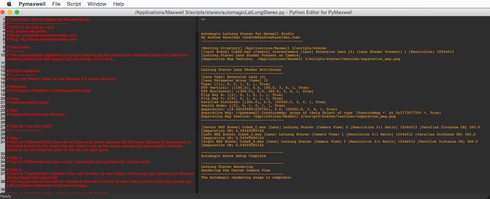
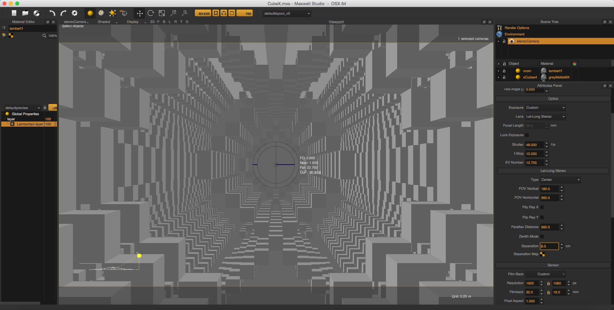
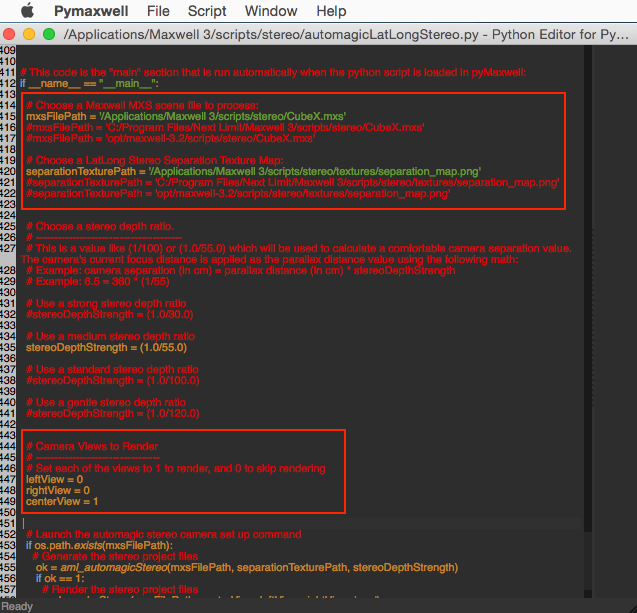
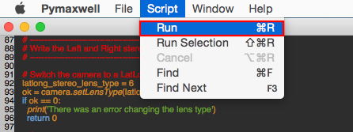
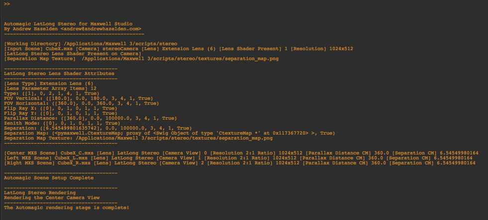

# Automagic LatLong Stereo for Maxwell Studio v0.1#
2015-12-07 10.00 am

By Andrew Hazelden  
Email: [andrew@andrewhazelden.com](mailto:andrew@andrewhazelden.com)  
Blog: [http://www.andrewhazelden.com](http://www.andrewhazelden.com)  

## Description ##
The automagicLatLongStereo.py script is used to quickly prepare your Maxwell Studio mxs scenes for rendering immersive 360&deg; LatLong Stereo VR content.

## Script Installation ##

Copy the "stereo" folder to your Maxwell 3.2 scripts directory:

**Windows**

`C:/Program Files/Next Limit/Maxwell 3/scripts/`

**Linux**

`/opt/maxwell-3.2/scripts/`

or

`$HOME/maxwell-3.2/scripts/`

or

`$HOME/maxwell64-3.2/scripts/`

**Mac**

`/Applications/Maxwell 3/scripts/`

## How do I use the script? ##

Step 1.
Edit your Maxwell MXS scene file so there is only one camera. Set the focus distance on the camera to the exact location in the scene that you want to use as the stereo camera rig's zero parallax distance (which is the convergence point for the left and right eyes).

Step 2.
Launch PyMaxwell and open up the `automagicLatLongStereo.py` python script.

Step 3.
Edit the "mxsFilePath" variable in the main function near the bottom of this script and specify your Maxwell Studio based MXS scene file.

Edit the "separationTexturePath" variable in the main function near the bottom of this script and specify your LatLong Stereo separation map texture image.

Edit the the camera views to render section in the main function near the bottom of this script and specify if you want to render the left, right, or center camera views by editing the "leftView", "rightView", or "centerView" variables to equal 1.

Step 4. Select the Script > Run menu item in PyMaxwell.

The script will start running. First the script will verify the mxs scene file exists.

If the mxs file is located then the scene will be opened in maxwell and the camera parameters will be edited. A LatLong Stereo lens shader extension is applied to the camera.

Camera's focus distance value will be used as the parallax distance for the lens shader and a suitable camera separation value is calculated based upon the current "stereoDepthStrength" value that is specified in the main function at the bottom of this script.

Then the lens shader's camera view is adjusted so a set of center, left and right camera view based scene files are generated with the names `<scene>_C.mxs`, `<scene>_L.mxs` and `<scene>.R.mxs`. These new files are saved to the same folder as the original mxs scene file.

Then the LatLong Stereo camera views that are enabled for rendering with the "leftView = 1", "rightView = 1", or "centerView = 1" options will be rendered in Maxwell Render.

