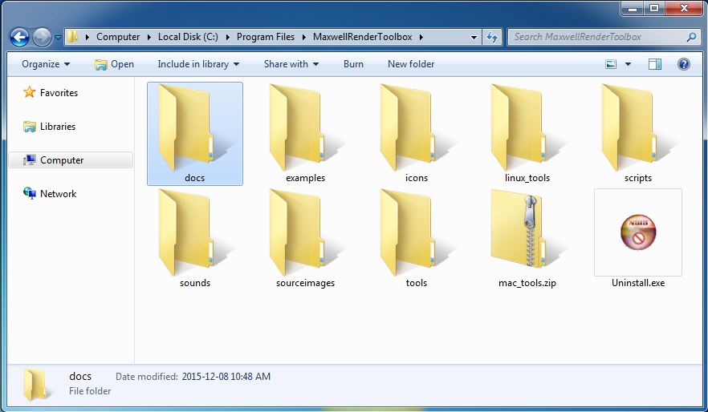
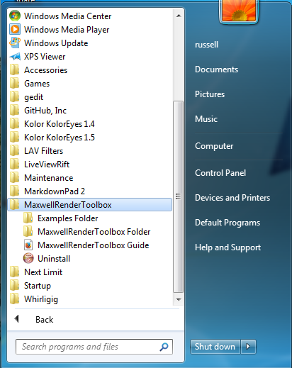

## Maxwell Render Toolbox Installer ##

The current version of Maxwell Render Toolbox supports Maxwell Render 3.2.0.4 and higher, and works on Windows 7+ 64-bit, Mac OS X 10.9, 10.10, or 10.11, and RHEL / Fedora / Centos Linux.

The Windows based Maxwell Render Toolbox installer will place the software in the folder:

`C:\Program Files\MaxwellRenderToolbox\`  

### Start Menu items ###

A Maxwell Render Toolbox Start menu folder is created that has a link to the uninstaller, the `Maxwell Render Toolbox Guide` HTML documentation, the `Examples` folder, and the `Maxwell Render Toolbox` folder.

### Windows Manual Install ###

#### Step 1. ####

Expand the **MaxwellRenderToolbox-v0.1-windows-mac-linux-manual-install.zip** archive to your desktop.

#### Step 2. ####

Move the expanded Maxwell Render Toolbox program folder to the following location on your hard drive:  

`C:\Program Files\MaxwellRenderToolbox\`

### Mac OS X Manual Install###

#### Step 1. ####

Expand the **MaxwellRenderToolbox-v0.1-windows-mac-linux-manual-install.zip** archive to your desktop.

#### Step 2. ####

Move the expanded Maxwell Render Toolbox program folder to the following location on your hard drive:  

`/Applications/MaxwellRenderToolbox/`

#### Step 3. ####

Open the `/Applications/MaxwellRenderToolbox/` folder and double click on the file `mac_tool.zip` to expand the ZIP archive. This will create a new folder called `mac_tools` inside of the MaxwellRenderToolbox directory `/Applications/MaxwellRenderToolbox/mac_tools/`. This folder has the Mac OS X 10.9, 10.10, and 10.11 compatible versions of several command line tools used by Maxwell Render Toolbox.

#### Step 4. ####

Download and install the Mac OS X build of the Imagemagick graphics library.

The Cactus Lab website has an Imagemagick for Mac OS X build that works with Mac OS X 10.5 to 10.10. You want the first download item `ImageMagick 6.9.1-0 for Mac OS X 10.5 – 10.10` listed on the Cactus Lab webpage:

[http://cactuslab.com/imagemagick/](http://cactuslab.com/imagemagick/)

The Imagemagick Project also hosts a Mac OS X Yosemite build version of the library:

[http://www.imagemagick.org/script/binary-releases.php#macosx](http://www.imagemagick.org/script/binary-releases.php#macosx)

Expand and run the Imagemagick graphics library installer.

If you have a copy of **Mac Ports** or **Brew** installed on your Mac you can also build your own version of Imagicmagick that will work with Maxwell Render Toolbox.

### Linux Manual Install ###

#### Step 1. ####

Expand the **MaxwellRenderToolbox-v0.1-windows-mac-linux-manual-install** archive to your desktop.

#### Step 2. ####

Move the expanded Maxwell Render Toolbox program folder to the following location on your hard drive:  

`/opt/MaxwellRenderToolbox`

#### Step 6. ####

Install the Hugin (Panotools), Imagemagick, and xclip libraries using YUM:

yum install ImageMagick 
yum install hugin
yum install xclip

**Note:** If you have a choice when installing Hugin (Panotools) on Linux, you should go for the Hugin 2013 or newer versions if you want better GPU accelerated warping. The Hugin 2011 release does work but the GPU warping features weren't as optimized as the 2013+ releases.

**Note:** The xclip library is used to allow the scripts to copy resources into you clipboard buffer so you can paste logs files and information into a text editor or other tools.

#### Step 7. ####

Install the ffmpeg library using YUM with a 3rd party repository:

yum install ffmpeg

**Note:** Redhat / Fedora / Centos Linux users will have to add a repository like **[RPM Fusion](http://rpmfusion.org/)** to their system since ffmpeg isn't available in the standard yum distribution. On the RPM Fusion website you want the add the [RPM Fusion free](http://rpmfusion.org/Configuration) repository to yum.

Ubuntu / Debian Linux users can also use the pre-compiled [ffmpeg package from the ffmpeg website directly](https://www.ffmpeg.org/download.html#build-linux).
