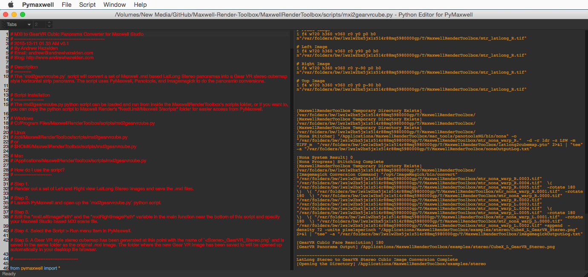

# MXI to GearVR Cubic Panorama Converter v0.1 #
2015-12-12 8.55 AM  
----
By Andrew Hazelden  
Email: [andrew@andrewhazelden.com](mailto:andrew@andrewhazelden.com)  
Blog: [http://www.andrewhazelden.com](http://www.andrewhazelden.com)  

## Description ##
The `mxi2gearvrcube.py` script will convert a set of Maxwell .mxi based LatLong Stereo panoramas into a Gear VR stereo cubemap style horizontal strip panorama. The script uses PyMaxwell, Panotools, and Imagemagick to do the panoramic conversions.

## How do I use the script? ##

Step 1. Render out a set of Left and Right view LatLong Stereo images and save the .mxi files.

Step 2. Launch PyMaxwell and open up the `mxi2gearvrcube.py` python script.

Step 3. Edit the "mxsLeftImagePath" and the "mxsRightImagePath" variable in the main function near the bottom of this script and specify your Maxwell Studio based MXS scene file.

Step 4. Select the **Script > Run** menu item in PyMaxwell.

Step 5. A Gear VR style stereo cubemap has been generated at this point with the name of `<Scene>_GearVR_Stereo.png` and is saved in the same folder as the original .mxi image. The folder where the new Gear VR image has been saved to will be opened up automatically in your desktop file browser.