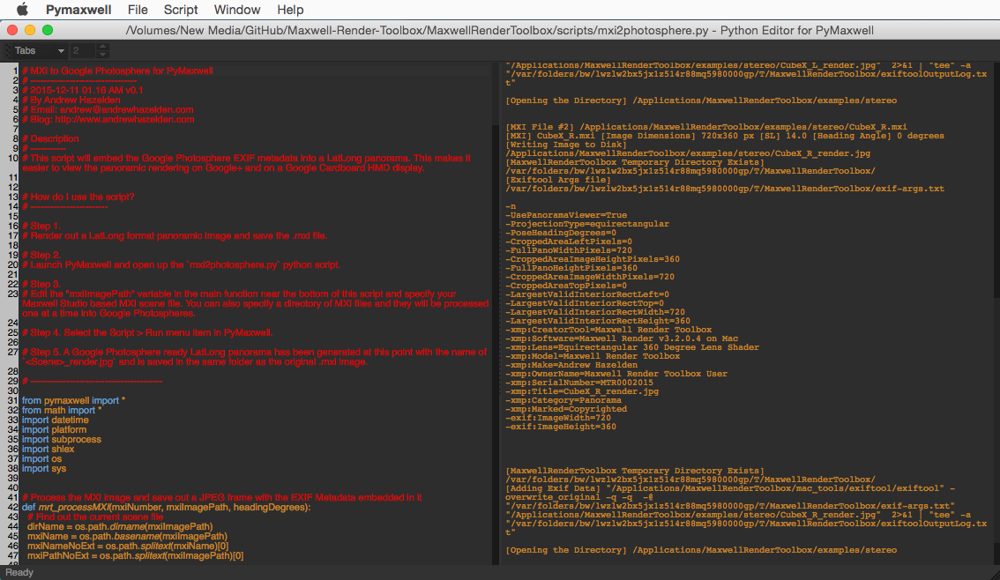

# MXI to Google Photosphere v0.1#
2015-12-11 1.08 AM
----
By Andrew Hazelden  
Email: [andrew@andrewhazelden.com](mailto:andrew@andrewhazelden.com)  
Blog: [http://www.andrewhazelden.com](http://www.andrewhazelden.com)  

## Description ##
The `mxi2photosphere.py` script will embed the Google Photosphere EXIF metadata into a LatLong panorama. This makes it easier to view the panoramic rendering on Google+ and on a Google Cardboard HMD display.

## How do I use the script? ##

Step 1. Render out a LatLong format panoramic image and save the .mxi file.

Step 2. Launch PyMaxwell and open up the `mxi2photosphere.py` python script.

Step 3. Edit the "mxiImagePath" variable in the main function near the bottom of this script and specify your Maxwell Studio based MXI scene file. You can also specify a directory of MXI files and they will be processed one at a time into Google Photospheres.

Step 4. Select the **Script > Run** menu item in PyMaxwell.

Step 5. A Google Photosphere ready LatLong panorama has been generated at this point with the name of `<Scene>_render.jpg` and is saved in the same folder as the original .mxi image.