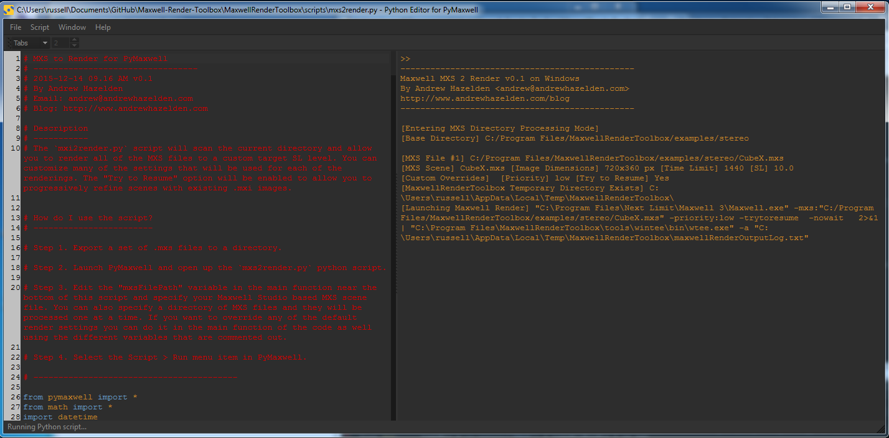

# MXS to Render v0.1 #
2015-12-14 09.24 AM
----
By Andrew Hazelden  
Email: [andrew@andrewhazelden.com](mailto:andrew@andrewhazelden.com)  
Blog: [http://www.andrewhazelden.com](http://www.andrewhazelden.com)  

## Description ##
The `mxs2render.py` script will scan the current directory and allow you to render all of the MXS files to a custom target SL level. You can customize many of the settings that will be used for each of the renderings. The "Try to Resume" option will be enabled to allow you to progressively refine scenes with existing .mxi images.

## How do I use the script? ##

Step 1. Export a set of .mxs files to a directory.

Step 2. Launch PyMaxwell and open up the `mxs2render.py` python script.

Step 3. Edit the "mxsFilePath" variable in the main function near the bottom of this script and specify your Maxwell Studio based MXS scene file. You can also specify a directory of MXS files and they will be processed one at a time.

If you want to override any of the default render settings you can do it in the main function of the code as well using the different variables that are commented out.

Step 4. Select the **Script > Run** menu item in PyMaxwell.

