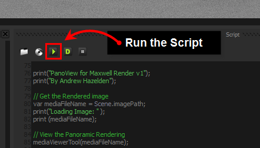

# PanoView for Maxwell Render #
2015-12-12 8.55 AM  
----
By Andrew Hazelden  
Email: [andrew@andrewhazelden.com](mailto:andrew@andrewhazelden.com)  
Blog: [http://www.andrewhazelden.com](http://www.andrewhazelden.com)  

## Overview ##

To make it easier to review Maxwell Render based panoramic 360 &deg; images, [Andrew Hazelden](http://www.andrewhazelden.com) has prepared a javascript tool called PanoView that allows you to send your panoramic LatLong and fulldome imagery straight from the Maxwell Render window to your Oculus Rift HMD and a desktop media viewer of your choice.

Currently 9 of the most popular media player tools are supported in PanoView. You can read the script's source code for installation details and on what changes can be made to the tool's configuration.

## PanoView Demo Video ##

You can view a [short demo video](https://www.youtube.com/watch?v=m83kwBiqqHY) of the PanoView script on Youtube.

## Known Issues ##

Note that only some of the viewing tools can handle EXR files natively but every panoramic 360 degree viewer tool can show a PNG or JPEG image.

## Supported Viewing Tools ##

**Kolor Eyes Desktop** (Free) - LatLong Capable - Is the default viewing tool in PanoView  
[http://www.kolor.com/kolor-eyes/download/](http://www.kolor.com/kolor-eyes/download/)

**Live View Rift** (Free) - Fulldome and LatLong Capable  
[http://soft.viarum.com/liveviewrift/](http://soft.viarum.com/liveviewrift/)

**Amateras Dome Player** (Free) - Fulldome and LatLong Capable  
[http://www.orihalcon.co.jp/amaterasplayer/en/](http://www.orihalcon.co.jp/amaterasplayer/en/)

**Shotgun/Tweak RV Player** - LatLong Capable - Has EXR Support  
[http://www.tweaksoftware.com/products/rv](http://www.tweaksoftware.com/products/rv)

**Assimilate Scratch Play** - LatLong Capable - Has EXR Support  
[http://www.assimilateinc.com/products/scratch-play/](http://www.assimilateinc.com/products/scratch-play/)

**Whirligig Viewer** (Free) - Fulldome and LatLong Capable  
[http://www.whirligig.xyz/](http://www.whirligig.xyz/)

**Adobe Speedgrade** - Has EXR Support  
[https://www.adobe.com/products/speedgrade.html](https://www.adobe.com/products/speedgrade.html)

**VLC Media Player** (Free)  
[https://www.videolan.org/vlc/](https://www.videolan.org/vlc/)

**DJV Viewer** (Free) - Has EXR Support  
[http://djv.sourceforge.net/](http://djv.sourceforge.net/)

## PanoView.ms Script Installation ##

**Step 1.** Place this Maxwell PanoView.ms javascript file in your Maxwell 3 scripts folder:

        C:\Program Files\Next Limit\Maxwell 3\scripts

**Step 2.** Launch Maxwell Render, and then display the script window.

**Step 3.** Use the "Load" button in the script window to open up the PanoView.ms script in Maxwell Render.

**Step 4.** Hit the "play" triangle button to run the script when you have a fulldome or latlong image in the maxwell.exe render view.

**Step 5.** If any of the specific viewer tools fail to launch when selected, you may have to check that the executable path variable "viewerPath" is correct for the specific version of the viewer tool that is installed on your hard drive.

## Extra Notes ##

- The default operating system for PanoView is Windows.  If you are on Mac or Linux, you should change the platform variable from "Windows" to either "Mac", or "Linux" so the correct viewing program is launched.

- Uncomment the media viewing tool you want to use in the `mediaViewerTool()` function by adding or removing the // comment symbols.
- Quite a few of the viewing tools only support 8-bit per channel formats for panoramas like PNG or JPEG so you won't be able to display an .exr file unless you are using a program like RV that is up for the task.
- This script can be launched with the `-postscript:[script path]` argument to run after a rendering finishes
- You can optionally remove the MXI file after opening the image output in the panoramic media viewing tool using the line `removeMXIFile()`.
